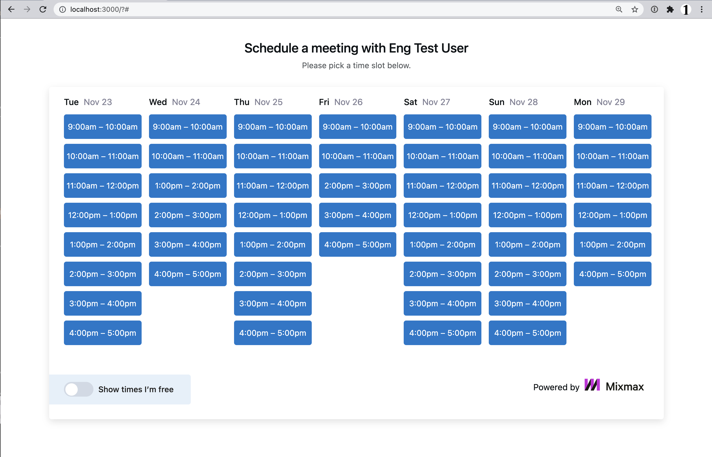

# App Test

The task is to build a feature that to allows a guest to book a meeting on a Mixmax user's calendar (the "host")

# Get Started

After unpacking the zip/tgz file, run the following:

```
cd package
npm install
npm test
npm start
```

Then open <http://localhost:3000/> in your browser.

## To run the app via docker

```
docker-compose up

```

### Sample Request Parameters
```
    {
    "type": "debit",
    "amount": 100
}
```

### Sample Success Response Parameters

```
    {
    "name": "Eng Test User",
    "timeslotLengthMin": 60,
    "timeslots": [
        "2022-08-01T09:00:00.000Z",
        "2022-08-01T10:00:00.000Z",
        "2022-08-01T11:00:00.000Z",
        "2022-08-01T12:00:00.000Z",
        "2022-08-01T13:00:00.000Z",
        "2022-08-01T14:00:00.000Z",
        "2022-08-01T15:00:00.000Z",
        "2022-08-01T16:00:00.000Z",
        "2022-08-02T10:00:00.000Z",
        "2022-08-02T11:00:00.000Z",
        "2022-08-02T12:00:00.000Z",
        "2022-08-02T13:00:00.000Z",
        "2022-08-02T14:00:00.000Z",
        "2022-08-02T15:00:00.000Z",
        "2022-08-02T16:00:00.000Z",
    ]
}
```

### Sample Error Response Parameters

```
   {
    "status": 400,
    "message": "Please provide the host userId"
}
```

# Project Structure


# Libraries Used

- Mocha - For running unit tests
- Restidy - Popular framework with a lean set of features for running apps
- Jest - For testing purpose

# Todo

I had a lot of fun building this. There are some improvements I can make:

- More tests, especially  unit tests for all other services and integration using super test.
- Add a dependency injection library like awilix to handle injection of dependencies
- Include a makefile to ease the execution of some common tasks

# Testing

- To run the tests, simply type `npm test`
- We can also get code coverage by `npm run coverage`



Thank you 👍

